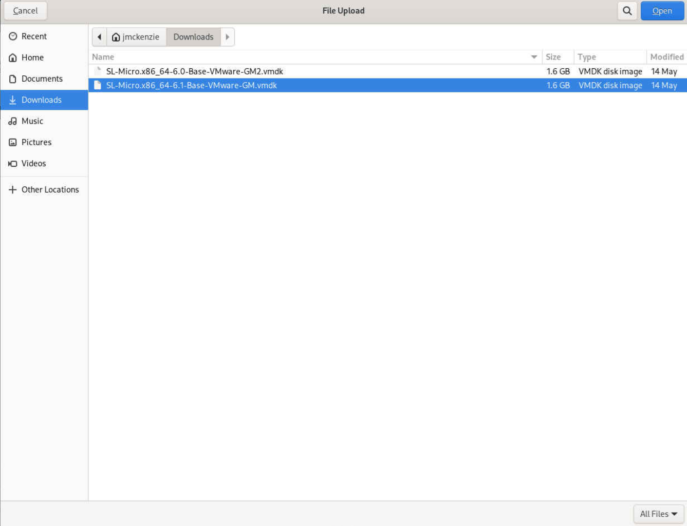

<font size="16"> Table of Contents</font> 

- [1. Build cloud-init user-data](#1-build-cloud-init-user-data)
  - [1.1. user-data example](#11-user-data-example)
    - [1.1.1. Replace SSCREGCODEXXX with your SCC Registration Code for the SLMicro product.](#111-replace-sscregcodexxx-with-your-scc-registration-code-for-the-slmicro-product)
    - [1.1.2. Hashed passwords generation:](#112-hashed-passwords-generation)
  - [1.2. Convert to base64](#12-convert-to-base64)
- [2. Stage SLMicro VMDK for use in vSphere](#2-stage-slmicro-vmdk-for-use-in-vsphere)
  - [2.1. Download SLMicro VMDK](#21-download-slmicro-vmdk)
  - [2.2. Upload SLMicro VMDK to Datastore Staging Area](#22-upload-slmicro-vmdk-to-datastore-staging-area)
- [3. Build Initial VM for Templating](#3-build-initial-vm-for-templating)
  - [3.1. Import SLMicro VMDK to Imported VMDK Location on Datastore](#31-import-slmicro-vmdk-to-imported-vmdk-location-on-datastore)
  - [3.2. Create a VM from SLMicro VMDK](#32-create-a-vm-from-slmicro-vmdk)
    - [3.2.1. New Virtual Machine Creation Screen](#321-new-virtual-machine-creation-screen)
    - [3.2.2. Customize Hardware](#322-customize-hardware)
  - [3.3. Power on VM for initial build](#33-power-on-vm-for-initial-build)
    - [3.3.1. Launch Webconsole to monitor installation](#331-launch-webconsole-to-monitor-installation)
- [4. Convert SLMicro Initial VM to vSphere Template](#4-convert-slmicro-initial-vm-to-vsphere-template)


# 1. Build cloud-init user-data
## 1.1. user-data example
```
#cloud-config
package_update: true
# disable root user
disable_root: true
runcmd:
# Disable root login over ssh, both password and key based
  - transactional-update --continue run sed -i 's/#PermitRootLogin prohibit-password/PermitRootLogin no/' /usr/etc/ssh/sshd_config
# Temporarily register template machine with scc to enable zypper repos
  - transactional-update --continue register --url https://scc.suse.com -r SCCREGCODEXXX
# Install system packages
  - transactional-update --continue --non-interactive pkg install jq net-tools ca-certificates cloud-init cloud-init-config-suse openssh-server open-vm-tools nfs-client
# Disable Auto update transaction-update.timer
  - transactional-update --continue run systemctl --now disable transactional-update.timer
# Set cgroupv1 hiearachy enabled
  - sed -i 's/GRUB_CMDLINE_LINUX=""/GRUB_CMDLINE_LINUX="systemd.unified_cgroup_hierarchy=0"/' /etc/default/grub
# Disable selinux
  - sed -i 's/selinux=1/selinux=0/' /etc/default/grub
# Enable ia32_emulation
  - sed -i 's/GRUB_CMDLINE_LINUX_DEFAULT="/GRUB_CMDLINE_LINUX_DEFAULT="ia32_emulation=on /' /etc/default/grub
  - sed -i 's/GRUB_TIMEOUT=.*/GRUB_TIMEOUT=0/' /etc/default/grub
# Potential Work Around for fsck issue
  - transactional-update --continue run dracut --regenerate-all -f -N
# Deregister template machine from scc
  - transactional-update --continue register -d --url https://scc.suse.com -r SCCREGCODEXXX
# Rebuild bootloader
  - transactional-update --continue run update-bootloader
# Reset cloud-init for next build
  - transactional-update --continue run cloud-init clean --logs

users:
# Add non-root user
  - name: harvest
    hashed_passwd: $6$e4RtND2Q2nDq1A4l$oeLJaqeWWIYnPHIxwcRTWrO6sqNIkmz3DroLmfxYSQTbeMq87UAL6uEQPB0BNKj.DNjVYd9Xa1xwcc9kVbBMI1
    lock_passwd: false
    shell: /bin/bash
# Add sudo entry for non-root user
    sudo: ALL=(ALL) NOPASSWD:ALL
# Add authorized keys
    ssh_authorized_keys:
      - ssh-rsa
        AAAAB3NzaC1yc2EAAAABJQAAAQEAkW7bd2iQBx8/A5pAbN207oWgcrV0lXgUHT2RZI/r/xbb9/ydLKCUBqmYhSKgBF80KJoWvE3cPeUDfThqo+qLlivc9vrTYZDMB+7wP/XGtA99jqFQsXDyC2gb8H/yKIRKu9eSrY9BHW9el80bpdxPID0YbxWYGJoxib5DO4mg3WtGIv9MeW4bvgoMj1ZhKMFrq2tYGv3P1MpuNgklwsGmUW+rIOVjhCEUz3KSr2+4EfcusOV6FD32SHkIgdeNy3C5MT1Oe6hk0bsUx/fZ9KS9YHX6b3LuIjkw1FuZBCByMgMWa4jO9QK/y76YMOFHOQtxhOszSuEkHtl6ijeejZYPtQ==
      - ssh-rsa
        AAAAB3NzaC1yc2EAAAADAQABAAABgQDZxAsYNJS266jPpWEsJwyibfZJN6FPNMHMxW9PlruOXJLrvdXc1wgo23d4c1BbaGiRoXW3xwd5zJwtr4dVB+QGtW1rCOYtHLGtvfIh6L5Y0SVrGOtDSVIpuwYtMnt4YBfZfBeDyJfnuvZ5E8CMNI1CekzfT7FgZnF1TQigOKgO8MUUS3HTNd3oly8D7w3QZLcjHufhFGojnZjEXfuT8tXqOaiCmlAzkdAmGczwTfXjZ3Q3KCEH20KTK31AxUP+80p75i2FE3QEMfHijXiuUbdEPTN8L2XSRe8nX7c3NZO5hWV+t9wLyfZgc5qHC5CS9fN1vGfLTpjQoaRoxKCS9dFJKVDg4huHcOz1go0YAQy6Ef+c7gkQv1ZV7VATTU9kVQWOy7+gztXnwoFXSg2qmn3JiJPVMDift2yozzpF+O4GpC9dgplBcugZT5Bg3TNPcfEBLGcNgIAC/bYma1z6+TDee0RDkWLg8JsCw554QCDI/B7Is1DZ/J4gTkmO1MNw3mM=

# set desired power_state after cloud-init finishes
power_state:
  mode: poweroff
  message: Powering Off for Templating
  timeout: 10
  condition: True
  ```
  
[user-data example](../code_examples/vsphere-cloud-init-userdata-example-final.md)


### 1.1.1. Replace SSCREGCODEXXX with your SCC Registration Code for the SLMicro product.

### 1.1.2. Hashed passwords generation:

Generate random salt

```
openssl rand -hex 16
```

Generate hashed password using openssl

```
openssl passwd -6 -salt 7d651f2c15538f8c2f5542c4c05d061b password
```

## 1.2. Convert to base64
```
server:/tmp # cat user-data |base64
I2Nsb3VkLWNvbmZpZwpwYWNrYWdlX3VwZGF0ZTogdHJ1ZQojIGRpc2FibGUgcm9vdCB1c2VyCmRp
c2FibGVfcm9vdDogdHJ1ZQpydW5jbWQ6CiMgVGVtcG9yYXJpbHkgcmVnaXN0ZXIgdGVtcGxhdGUg
bWFjaGluZSB3aXRoIHNjYyB0byBlbmFibGUgenlwcGVyIHJlcG9zCiAgLSB0cmFuc2FjdGlvbmFs
LXVwZGF0ZSAtLWNvbnRpbnVlIHJlZ2lzdGVyIC0tdXJsIGh0dHBzOi8vc2NjLnN1c2UuY29tIC1y
IFNDQ1JFR0NPREVYWFgKIyBJbnN0YWxsIHN5c3RlbSBwYWNrYWdlcwogIC0gdHJhbnNhY3Rpb25h
bC11cGRhdGUgLS1jb250aW51ZSAtLW5vbi1pbnRlcmFjdGl2ZSBwa2cgaW5zdGFsbCBqcSBuZXQt
dG9vbHMgY2EtY2VydGlmaWNhdGVzIGNsb3VkLWluaXQgY2xvdWQtaW5pdC1jb25maWctc3VzZSBv
cGVuc3NoLXNlcnZlciBvcGVuLXZtLXRvb2xzIG5mcy1jbGllbnQKIyBEaXNhYmxlIEF1dG8gdXBk
YXRlIHRyYW5zYWN0aW9uLXVwZGF0ZS50aW1lcgogIC0gdHJhbnNhY3Rpb25hbC11cGRhdGUgLS1j
b250aW51ZSBydW4gc3lzdGVtY3RsIC0tbm93IGRpc2FibGUgdHJhbnNhY3Rpb25hbC11cGRhdGUu
dGltZXIKIyBTZXQgY2dyb3VwdjEgaGllYXJhY2h5IGVuYWJsZWQKICAtIHNlZCAtaSAncy9HUlVC
X0NNRExJTkVfTElOVVg9IiIvR1JVQl9DTURMSU5FX0xJTlVYPSJzeXN0ZW1kLnVuaWZpZWRfY2dy
b3VwX2hpZXJhcmNoeT0wIi8nIC9ldGMvZGVmYXVsdC9ncnViCiMgRGlzYWJsZSBzZWxpbnV4CiAg
LSBzZWQgLWkgJ3Mvc2VsaW51eD0xL3NlbGludXg9MC8nIC9ldGMvZGVmYXVsdC9ncnViCiMgRW5h
YmxlIGlhMzJfZW11bGF0aW9uCiAgLSBzZWQgLWkgJ3MvR1JVQl9DTURMSU5FX0xJTlVYX0RFRkFV
TFQ9Ii9HUlVCX0NNRExJTkVfTElOVVhfREVGQVVMVD0iaWEzMl9lbXVsYXRpb249b24gLycgL2V0
Yy9kZWZhdWx0L2dydWIKICAtIHNlZCAtaSAncy9HUlVCX1RJTUVPVVQ9LiovR1JVQl9USU1FT1VU
PTAvJyAvZXRjL2RlZmF1bHQvZ3J1YgojIERlcmVnaXN0ZXIgdGVtcGxhdGUgbWFjaGluZSBmcm9t
IHNjYwogIC0gdHJhbnNhY3Rpb25hbC11cGRhdGUgLS1jb250aW51ZSByZWdpc3RlciAtZCAtLXVy
bCBodHRwczovL3NjYy5zdXNlLmNvbSAtciBTQ0NSRUdDT0RFWFhYCiMgUmVidWlsZCBib290bG9h
ZGVyCiAgLSB0cmFuc2FjdGlvbmFsLXVwZGF0ZSAtLWNvbnRpbnVlIHJ1biB1cGRhdGUtYm9vdGxv
YWRlcgojIFJlc2V0IGNsb3VkLWluaXQgZm9yIG5leHQgYnVpbGQKICAtIHRyYW5zYWN0aW9uYWwt
dXBkYXRlIC0tY29udGludWUgcnVuIGNsb3VkLWluaXQgY2xlYW4gLS1sb2dzCgp1c2VyczoKIyBB
ZGQgbm9uLXJvb3QgdXNlcgogIC0gbmFtZTogaGFydmVzdAogICAgaGFzaGVkX3Bhc3N3ZDogJDYk
ZTRSdE5GMlEybkRxMUE0bCRvZUxKYXFlV1dJWW5QSEl4d2NSVFdyTzZzcU5Ja216M0Ryb0xtZnhZ
U1FUYmVNcTg3VUFMNnVFUVBCMEJOS2ouRE5qVllkOVhhMXh3Y2M5a1ZiQk1JMQogICAgbG9ja19w
YXNzd2Q6IGZhbHNlCiAgICBzaGVsbDogL2Jpbi9iYXNoCiMgQWRkIHN1ZG8gZW50cnkgZm9yIG5v
bi1yb290IHVzZXIKICAgIHN1ZG86IEFMTD0oQUxMKSBOT1BBU1NXRDpBTEwKIyBBZGQgYXV0aG9y
aXplZCBrZXlzCiAgICBzc2hfYXV0aG9yaXplZF9rZXlzOgogICAgICAtIHNzaC1yc2EKICAgICAg
ICBBQUFBQjNOemFDMXljMkVBQUFBQkpRQUFBUUVBa1c3YmQyaVFCeDgvQTVwQWJOMjA3b1dnY3JW
MGxYZ1VIVDJSWkkvci94YmI5L3lkTEtDVUJxbVloU0tnQkY4MEtKb1d2RTNjUGVVRGZUaHFvK3FM
bGl2Yzl2clRZWkRNQis3d1AvWEd0QTk5anFGUXNYRHlDMmdiOEgveUtJUkt1OWVTclk5QkhXOWVs
NzBicGR4UElEMFlieFdZR0pveGliNURPNG1nM1d0R0l2OU1lVzRidmdvTWoxWmhLTUZycTJ0WUd2
M1AxTXB1TmdrbHdzR21VVytySU9WamhDRVV6M0tTcjIrNEVmY3VzT1Y2RkQzMlNIa0lnZGVOeTND
NU1UMU9lNmhrMGJzVXgvZlo5S1M5WUhYNmIzTHVJamt3MUZ1WkJDQnlNZ01XYTRqTzlRSy95NzZZ
TU9GSE9RdHhoT3N6U3VFa0h0bDZpamVlalpZUHRRPT0KICAgICAgLSBzc2gtcnNhCiAgICAgICAg
QUFBQUIzTnphQzF5YzJFQUFBQURBUUFCQUFBQmdRRFp4QXNZTkpTMjY2alBwV0VzSnd5aWJmWkpO
NkZQTk1ITXhXOVBscnVPWEpMcnZkWGMxd2dvMjNkNGMxQmJhR2lSb1hXM3h3ZDV6Snd0cjRkVkIr
UUd0VzFyQ09ZdEhMR3R2ZkltNUw1WTBTVnJHT3REU1ZJcHV3WXRNbnQ0WUJmWmZCZUR5SmZudXZa
NUU4Q01OSTFDZWt6ZlQ3RmdabkYxVFFpZ09LZ084TVVVUzNIVE5kM29seThEN3czUVpMY2pIdWZo
Rkdvam5aakVYZnVUOHRYcU9haUNtbEF6a2RBbUdjendUZlhqWjNRM0tDRUgyMEtUSzMxQXhVUCs4
MHA3NWkyRkUzUUVNZkhpalhpdVViZEVQVE44TDJYU1JlOG5YN2MzTlpPNWhXVit0OXdMeWZaZ2M1
cUhDNUNTOWZOMXZHZkxUcGpRb2FSb3hLQ1M5ZEZKS1ZEZzRodUhjT3oxZ28wWUFReTZFZitjN2dr
UXYxWlY3VkFUVFU5a1ZRV095NytnenRYbndvRlhTZzJxbW4zSmlKUFZNRGlmdDJ5b3p6cEYrTzRH
cEM5ZGdwbEJjdWdaVDVCZzNUTlBjZkVCTEdjTmdJQUMvYlltYTF6NitURGVlMFJEa1dMZzhKc0N3
NTU0UUNESS9CN0lzMURaL0o0Z1RrbU8xTU53M21NPQoKIyBzZXQgZGVzaXJlZCBwb3dlcl9zdGF0
ZSBhZnRlciBjbG91ZC1pbml0IGZpbmlzaGVzCnBvd2VyX3N0YXRlOgogIG1vZGU6IHBvd2Vyb2Zm
CiAgbWVzc2FnZTogUG93ZXJpbmcgT2ZmIGZvciBUZW1wbGF0aW5nCiAgdGltZW91dDogMTAKICBj
b25kaXRpb246IFRydWUK
```
[user-data base64 example](../code_examples/vsphere-cloud-init-userdata-example-final-base64.txt)


# 2. Stage SLMicro VMDK for use in vSphere
## 2.1. Download SLMicro VMDK
The SLMicro images are avalable here:
[SLMicro Download Page](https://www.suse.com/download/sle-micro/)


You will need to login with you SCC Account to access the downloads.  


If prompted for two factor authentication, follow the instructions.  Once logged in, choose the appropriate vmdk image to download.


## 2.2. Upload SLMicro VMDK to Datastore Staging Area
Navigate to Datastore Staging Area


Click "Upload Files" and select the appropriate vmdk to upload.



Click "Open" (may vary depending on browser)


# 3. Build Initial VM for Templating
## 3.1. Import SLMicro VMDK to Imported VMDK Location on Datastore

Import the downloaded vmdk for use in building Template.  This step is necessary to make sure the VMDK is fully expanded and leaves the original VMDK in tact for future use.

Select the Uploaded vmdk in the Staging area


Click "Move To" to copy VMDK to Imported VMDK location and then click "OK"


```
Note:
The downloaded VMDK is sparse and may have some difficulty as is with Paravirtual SCSI controller if it is not expanded.  Moving the VMDK performs a copy of the source with the full volume size defined in the VMDK, and prevents the ParaVirtual SCSI controller issues when combined with choosing a compatible VM version later on. 
```
Wait for the image to complete copying.  

## 3.2. Create a VM from SLMicro VMDK

Click on "VMs and Templates"


Right Click the Cluster or Host and select "New Virtual Machine"


### 3.2.1. New Virtual Machine Creation Screen

Select "Create a New Virtual Machine" and click "Next"


Select a Name and Folder/Host/Cluster and click "Next"


Select a Compute Resource and click "Next"


Select the target Datastore and click "Next"


Select Compatibility with "ESX 6.7 and later" and click "Next"
```
Note:
We choose "ESX 6.7 and later" to insure compatibility with the generated vmdk.  Newer versions of the virtual machine compatibility can interfere with correctly assigning disks to the Paravirtual SCSI controller when we try to boot the VM for the first time.
```


On the Guest OS, Select "Guest OS Family" as "Linux", "Guest OS Version" as "SUSE Linux Enterprise 15 (64-bit)", and click "Next"


### 3.2.2. Customize Hardware
Remove preconfigured HD


Add New Device "Existing Hard Disk" to VM


Select Datastore


Select SLMicro VMDK from Imported VMDK Location and click "OK"


Add Required guestinfo parameters in Advanced Options


Set Attribute "guestinfo.userdata.encoding" with Value "base64" and click "Add"


Set Attribute "guestinfo.userdata" with Value of the [base64 encoded userdata we created earlier](#convert-to-base64) and click "Add"


Click "Next"


Click "Finish"


## 3.3. Power on VM for initial build


### 3.3.1. Launch Webconsole to monitor installation


```
Note:
The VM should power down automatically based on the "powerstate" settings we configured in the userdata.
```

# 4. Convert SLMicro Initial VM to vSphere Template
Convert VM to Template either from the "Actions" pull down menu (shown), or by right clicking the name of the template and then choosing "Template" and clicking "Convert to Template"


Confirm Template Conversion by clicking "Yes"


```
Note:
You should now be able to clone the template as needed for deployment of systems either directly from vSphere or through Rancher/CAPI/Turtles.  

For each use case, build separate templates and use different user-data for customization.  Simply comment out what is not needed in the user-data and build a base64 encoded version of the user-data to be populated in "guestinfo.userdata" attribute value when building your unique templates.
```

