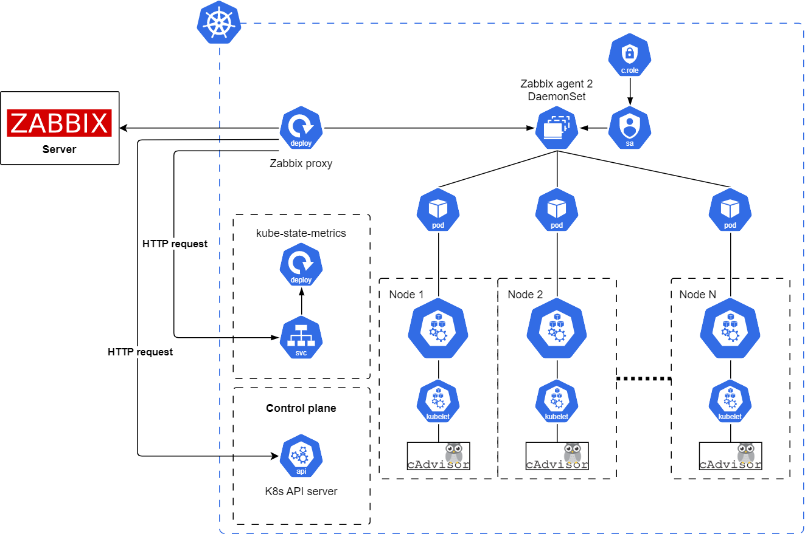

# Zabbix Helm Chart

# Introduction

This Helm chart installs components for the Kubernetes cluster monitoring by Zabbix.

The diagram of the architecture is presented below:



Source (YouTube): [`Monitoring Kubernetes with Zabbix`](https://youtu.be/2dPFvJrK9Mw)

## kube-state-metric

[**kube-state-metrics (KSM)**](https://github.com/kubernetes/kube-state-metrics) is a simple service that listens to the Kubernetes API server and generates metrics about the state of the objects in the cluster.

If kube-state-metrics has already been installed in the cluster, it can be used instead of the one that is being deployed by this chart. Set the `kube-state-metrics.enabled` parameter value to `false` and specify the endpoint name in the macro `{$KUBE.STATE.ENDPOINT.NAME}` in the "Kubernetes cluster state by HTTP" template according to the environment. If the kube-state-metrics configuration deviates from the default values, some metrics may not be available.

**Note**

kube-state-metrics with OpenShift installation requires one modification on ReplicaSet level. This block must be removed or changed:

```bash
      securityContext:
        runAsUser: 65534
        runAsGroup: 65534
        fsGroup: 65534
```

## Zabbix agent

**Zabbix agent** is deployed in passive mode (by default) as a DaemonSet on all cluster nodes to monitor individual node host resources using the "Linux by Zabbix agent" template.

Depending on the Kubernetes distribution used, it may be necessary to adjust the taint in `zabbixAgent.tolerations` parameter, if monitoring of control plane nodes is required.

If the monitoring of nodes with "Linux by Zabbix agent" template is not required, it can be disabled by setting the `zabbixAgent.enabled` parameter to `false`, which will prevent DaemonSet from being deployed.

## Zabbix proxy

**Zabbix proxy** is installed in the cluster in active mode (by default) as a Deployment with a single replica. It collects data from Kubernetes API, kube-state-metrics endpoint and Zabbix agents. All collected data is buffered locally and then transferred to the external **Zabbix server** to which the proxy belongs and is used for monitoring.

If Zabbix proxy has already been installed in the cluster, it can be used instead of the one that is being deployed by this chart. Set the `zabbixProxy.enabled` parameter value to `false` and add the proxy to the Zabbix server that is used for monitoring.

**Note**

Kubernetes API, kube-state-metrics endpoint and Zabbix agents (if deployed) must be reachable by the proxy.

# Tested versions

- Kubernetes cluster 1.26
- Helm 3.0+
- Zabbix server 6.0+
- kube-state-metrics 2.2.0, 2.9.2

# Installation

Install the [kubectl](https://kubernetes.io/docs/reference/kubectl/overview/) and [helm](https://helm.sh/docs/) tools following the instructions.

Add the repository:

```bash
helm repo add zabbix-chart-6.4  https://cdn.zabbix.com/zabbix/integrations/kubernetes-helm/6.4
```

Export the default values of the chart ``helm-zabbix`` to the file ``$HOME/zabbix_values.yaml``:

```bash
helm show values zabbix-chart-6.4/zabbix-helm-chrt > $HOME/zabbix_values.yaml
```
Change the `zabbixProxy.env.ZBX_SERVER_HOST` environment variable value in the file `$HOME/zabbix_values.yaml` to the address of the Zabbix server that is used for monitoring and which is reachable by the Zabbix proxy. Other values can be changed according to the environment if needed.

List the namespaces of the cluster.

```bash
kubectl get namespaces
```

Create the namespace ``monitoring`` if it does not exist in the cluster.

```bash
kubectl create namespace monitoring
```

Deploy the chart in the Kubernetes cluster (update the YAML files paths if necessary).

```bash
helm install zabbix zabbix-chart-6.4/zabbix-helm-chrt --dependency-update -f $HOME/zabbix_values.yaml -n monitoring
```

Get the token automatically created for the service account.

```bash
kubectl get secret zabbix-service-account -n monitoring -o jsonpath={.data.token} | base64 -d
```
## Postinstallation steps

Set up the [`Kubernetes templates`](https://git.zabbix.com/projects/ZBX/repos/zabbix/browse/templates/app/kubernetes_http?at=release%2F6.4) according to the instructions.


## Other commands

View the services.

```bash
kubectl get svc -n monitoring
```

View the pods.

```bash
kubectl get pods -n monitoring
```

View the information about pods.

```bash
kubectl describe pods/POD_NAME -n monitoring
```

View all the containers in a pod.

```bash
kubectl get pods POD_NAME -n monitoring -o jsonpath='{.spec.containers[*].name}*'
```

View the container logs of pods.

```bash
kubectl logs -f pods/POD_NAME -n monitoring
```

Access the command prompt of the pod container.

```bash
kubectl exec -it pods/POD_NAME -n monitoring -- sh
```

# Uninstallation

To uninstall/delete the ``zabbix`` deployment:

```bash
helm uninstall zabbix -n monitoring
```

# License

[`GNU GPL v2`](/LICENSE)

# Configuration

The following table lists the main configurable parameters of the chart and their default values.

| Key | Type | Default | Description |
|-----|------|---------|-------------|
| nameOverride | string | | Replaces the name of the chart in the Chart.yaml |
| fullnameOverride | string | | Replaces the generated name |
| kube-state-metrics.enabled | bool | `true`| If true, deploys the kube-state-metrics deployment |
| rbac.create |	bool |	`true` |	Specifies whether the RBAC resources should be created |
| rbac.additionalRulesForClusterRole |	list |	`[]` |	Specifies additional rules  for clusterRole |
| serviceAccount.create	| bool	| `true` | Specifies whether a service account should be created
| serviceAccount.name |	string| `zabbix-service-account` |	Name of the service account to use. If not set, name is generated using the fullname template |
| zabbixProxy.enabled | bool | `false` | Enables use of Zabbix proxy |
| zabbixProxy.resources | object | `{}` | Set resources requests/limits for Zabbix proxy |
| zabbixProxy.image.repository | string | `"zabbix/zabbix-proxy-sqlite3"` | Zabbix proxy Docker image name |
| zabbixProxy.image.tag | string | `"alpine-6.4.6"` | Tag of Docker image of Zabbix proxy |
| zabbixProxy.image.pullPolicy | string | `"IfNotPresent"` | Pull policy of Docker image |
| zabbixProxy.image.pullSecrets | list | `[]` | List of dockerconfig secrets names to use when pulling images. Secrets must be manually created in the namespace. |
| zabbixProxy.env.ZBX_PROXYMODE | int | `0` | This variable allows switching Zabbix proxy mode. By default, the value is 0 - active proxy. Allowed values are 0 - active proxy and 1 - passive proxy. |
| zabbixProxy.env.ZBX_SERVER_HOST | string | `"127.0.0.1"` | Zabbix server host. If you need to change port number, add a colon `:` followed by the port number to the end of the value. |
| zabbixProxy.env.ZBX_DEBUGLEVEL | int | `3` |  This variable is used to specify debug level. By default, the value is 3|
| zabbixProxy.env.ZBX_JAVAGATEWAY_ENABLE | bool | `false` | This variable enables communication with Zabbix Java Gateway to collect Java related checks. By default, the value is false |
| zabbixProxy.env.ZBX_CACHESIZE | string | `"128M"` | Cache size |
| zabbixProxy.env.ZBX_PROXYCONFIGFREQUENCY | string | `10` | How often proxy retrieves configuration data from Zabbix server, in seconds. Active proxy parameter. Ignored for passive proxies |
| zabbixProxy.service.port | int | `10051` | Port to expose service |
| zabbixProxy.service.annotations | object | `{}` |  Zabbix proxy data Service labels annotations |
| zabbixProxy.service.labels | object | `{}` | Zabbix proxy data Service labels |
| zabbixProxy.service.targetPort | int | `10051` | Port of application pod |
| zabbixProxy.service.type | string | `"ClusterIP"` | Type of service for Zabbix proxy |
| zabbixProxy.service.externalIPs | list | `[]` | External IP for Zabbix proxy |
| zabbixProxy.service.loadBalancerIP | string | `""` | Only use if service.type is "LoadBalancer" |
| zabbixProxy.service.loadBalancerSourceRanges | list | `[]` | Only use if service.type is "LoadBalancer" |
| zabbixProxy.nodeSelector | object | `{}` | Node selector configurations |
| zabbixProxy.tolerations | object | `{}`| Tolerations configurations for Zabbix proxy |
| zabbixProxy.affinity | object | `{}`| Affinity configurations for Zabbix proxy |
| zabbixProxy.persistentVolume.enabled |  bool | `false` | If true, Zabbix proxy will create/use a Persistent Volume Claim |
| zabbixProxy.persistentVolume.accessModes | list | `- ReadWriteOnce` | Zabbix proxy data Persistent Volume access modes |
| zabbixProxy.persistentVolume.annotations | object | `{}` | Zabbix proxy data Persistent Volume Claim annotations |
| zabbixProxy.persistentVolume.existingClaim | string | `''` | Zabbix proxy data Persistent Volume existing claim name |
| zabbixProxy.persistentVolume.mountPath | string | `/data` | Zabbix proxy data Persistent Volume mount root path |
| zabbixProxy.persistentVolume.size | string | `2Gi` | Zabbix proxy data Persistent Volume size |
| zabbixProxy.persistentVolume.storageClass | string | `"-"` | Zabbix proxy data Persistent Volume Storage Class |
| zabbixProxy.persistentVolume.volumeBindingMode | string | `''` | Zabbix proxy data Persistent Volume Binding Mode |
| zabbixProxy.persistentVolume.subPath | string | `''` | Subdirectory of Zabbix proxy data Persistent Volume to mount |
| zabbixAgent.enabled | bool | `true` | Enables use of Zabbix agent |
| zabbixAgent.resources | object | `{}` |  Set resources requests/limits for Zabbix agents |
| zabbixAgent.volumes_host | bool | `true` | Whether a preconfigured set of volumes to be mounted (`/`, `/etc`, `/sys`, `/proc`, `/var/run`)|
| zabbixAgent.volumes | list | `[]`  | Add additional volumes to be mounted |
| zabbixAgent.volumeMounts | list | `[]` | Add additional volumes to be mounted |
| zabbixAgent.image.repository | string | `"zabbix/zabbix-agent2"` | Zabbix agent Docker image name |
| zabbixAgent.image.tag | string | `"alpine-6.4.6"` | Tag of Docker image of Zabbix agent |
| zabbixAgent.image.pullPolicy | string | `"IfNotPresent"` | Pull policy of Docker image |
| zabbixAgent.image.pullSecrets | list | `[]` | List of dockerconfig secrets names to use when pulling images. Secrets must be manually created in the namespace. |
| zabbixAgent.env.ZBX_SERVER_HOST | string | `"0.0.0.0/0"` | Zabbix server host |
| zabbixAgent.env.ZBX_SERVER_PORT | int | `10051` | Zabbix server port |
| zabbixAgent.env.ZBX_PASSIVE_ALLOW | bool | `true` | This variable is boolean (true or false) and enables or disables feature of passive checks. By default, the value is true |
| zabbixAgent.env.ZBX_ACTIVE_ALLOW | bool | `false` | This variable is boolean (true or false) and enables or disables feature of active checks |
| zabbixAgent.env.ZBX_DEBUGLEVEL | int | `3` |  This variable is used to specify debug level. By default, the value is 3|
| zabbixAgent.env.ZBX_TIMEOUT | int | 4 |  This variable is used to specify timeout for processing checks. By default, the value is 4|
| zabbixAgent.service.type | string | `"ClusterIP"` | Type of service for Zabbix agent |
| zabbixAgent.service.port | int | `10050` | Port to expose service |
| zabbixAgent.service.annotations | object | ` agent.zabbix/monitor: "true"` |  Zabbix agent data Service labels annotations |
| zabbixAgent.service.labels | object | `{}` | Zabbix agent data Service labels |
| zabbixAgent.service.targetPort | int | `10050` | Port of application pod |
| zabbixAgent.service.externalIPs | list | `[]` | External IP for Zabbix agent |
| zabbixAgent.serviceAccount.create	| bool	| `true` | Specifies whether a service account should be created|
| zabbixAgent.serviceAccount.name |	string| `zabbix-agent-service-account` |	The name of the service account to use. If not set, name is generated using the fullname template |
| zabbixAgent.nodeSelector | object | `kubernetes.io/os: linux` | nodeSelector configurations |
| zabbixAgent.tolerations | list | ` - effect: NoSchedule key: node-role.kubernetes.io/control-plane`| Allows scheduling Zabbix agents on tainted nodes |
| zabbixAgent.rbac.create |	bool |	`true` |	Specifies whether the RBAC resources should be created |
| zabbixAgent.rbac.pspEnabled |	bool |	`true` |	If true, create & use Pod Security Policy resources |

### `agent.volumes_host`

The following directories will be mounted from the host, inside the pod:

Host | Pod |
---- | ----
`/` | `/hostfs`
`/sys` | `/hostfs/sys`
`/proc` | `/hostfs/proc`
