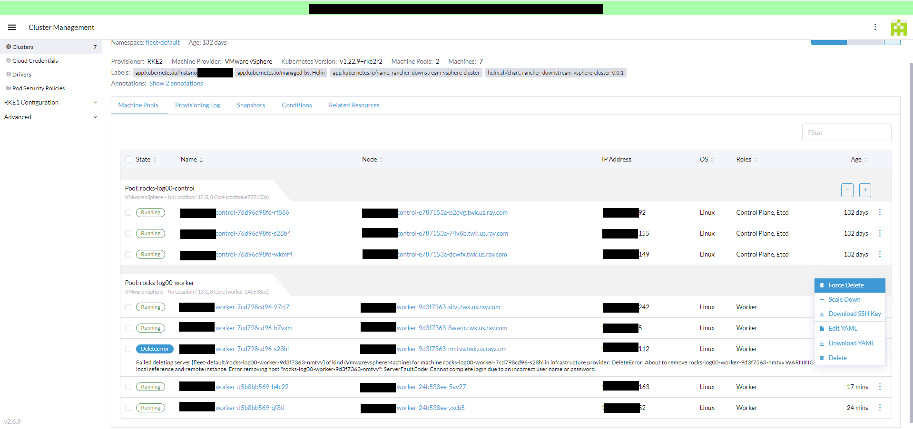
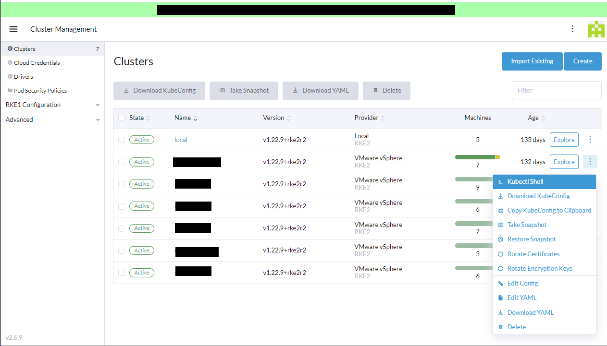
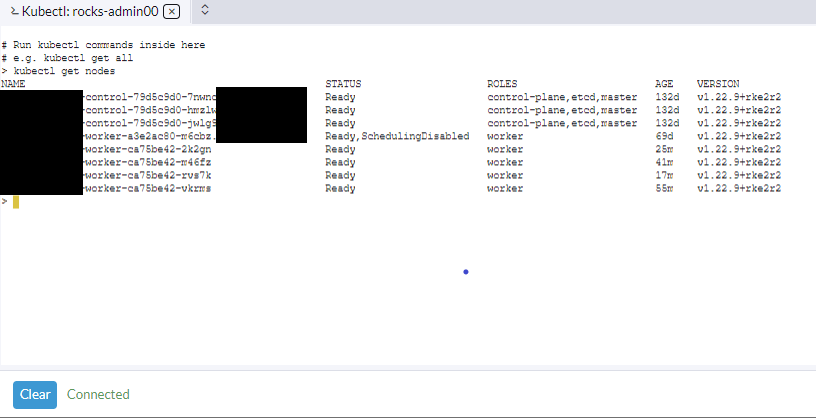
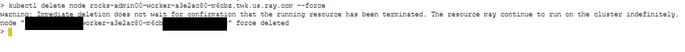

# Rolling Upgrade RKE2 Downstream Cluster OS Image

## Structure of rancher-Vmwarevsphereconfigs

```
└── rancher-Vmwarevsphereconfigs
    ├── { management_cluster_00 }
    │   └── clusters
    │       ├── { downstream_cluster_x }
    │       │   ├── nc-vsphere-control-config-xxxx.yaml
    │       │   ├── nc-vsphere-master-config-xxxx.yaml
    │       │   └── nc-vsphere-worker-config-xxxx.yaml
    │       └── { downstream_cluster_y }
    │           ├── nc-vsphere-control-config-yyyy.yaml
    │           ├── nc-vsphere-master-config-yyyy.yaml
    │           └── nc-vsphere-worker-config-yyyy.yaml    
    └── { management_cluster_01 }
        └── clusters
            ├── { downstream_cluster_z }
            │   ├── nc-vsphere-control-config-zzzz.yaml
            │   ├── nc-vsphere-master-config-zzzz.yaml
            │   └── nc-vsphere-worker-config-zzzz.yaml
            └── { downstream_cluster_a }
                ├── nc-vsphere-control-config-aaaa.yaml
                ├── nc-vsphere-master-config-aaaa.yaml
                └── nc-vsphere-worker-config-aaaa.yaml  
```

## How to initially populate values from a Rancher Management Server

- Download the kubeconfig for the Rancher Management Server for use with kubectl

- Verify kubectl is talking to the intended cluster

- Run the following command against the Rancher Management Server

    ```
    kubectl get VmwarevsphereConfigs.rke-machine-config.cattle.io -n fleet-default --no-headers \
    --output=custom-columns=ResourceName:.metadata.name,Cluster:.metadata.ownerReferences[*].name | \
    while IFS= read -r line; do \
    mkdir `echo $line| awk '{print $2}'` 2> /dev/null
    kubectl get VmwarevsphereConfigs.rke-machine-config.cattle.io -n fleet-default `echo $line| \
    awk '{print $1}'` -o yaml >> `echo $line| awk '{print $2}'`/`echo $line|awk '{print $1}'`.yaml; \
    done

    ```

- Copy file structure to the appropriate area of the repo structure

## How to update base template in each of the clusters yaml files (control, master, or worker)

- Edit the line 'cloneFrom'

    ```
      cloneFrom: /{{ datacenter }}/vm/vm-templates/vm-template
    ```

- Add ssh-keygen command to recreate system keys in the "runcmd" section of cloudConfig if it does not already exist just in case.
  
    ```
      runcmd:
        - ssh-keygen -A

    ```

- Get the current resourceVersion by running the following command against the resource you are updating (e.g. nc-vsphere-control-config-c52c9)

    ```
    kubectl get VmwarevsphereConfigs.rke-machine-config.cattle.io -n fleet-default --output=custom-columns=ResourceName:.metadata.name,Cluster:.metadata.ownerReferences[*].name,ResourceVersion:.metadata.resourceVersion nc-vsphere-control-config-c52c9 
    ```

  Which will return the following information

    ```
    ResourceName                      Cluster         ResourceVersion
    nc-vsphere-control-config-c52c9   mycluster       76232942
    ```

- Update the resourceVersion with the current value. 

    ```
    metadata:
      annotations:
        field.cattle.io/creatorId: u-luidp57hju
        helm.sh/hook: pre-install,pre-upgrade
        helm.sh/hook-weight: "-5"
        ownerBindingsCreated: "true"
      generation: 2
      labels:
        app.kubernetes.io/instance: rocks-admin00
        app.kubernetes.io/managed-by: Helm
        app.kubernetes.io/name: rancher-downstream-vsphere-cluster
        helm.sh/chart: rancher-downstream-vsphere-cluster-0.0.1
      name: nc-vsphere-control-config-c52c9
      namespace: fleet-default
      ownerReferences:
      - apiVersion: provisioning.cattle.io/v1
        blockOwnerDeletion: true
        controller: true
        kind: Cluster
        name: rocks-admin00
        uid: fea5fbe0-96f6-41ce-95fa-304581c8a6cf
      resourceVersion: "76232942"
      uid: 9aae6aad-2e98-4f1e-9d17-cea5423c4268
    ```

- Commit changes to git

## Applying updated OS base images for clusters

- Download the kubeconfig for the Rancher Management Server for use with kubectl

- Verify kubectl is talking to the intended cluster

- Apply the yaml file on the management cluster for the worker nodes (if they exist)

    ```
    cd /{ git_path }/{ management_cluster_00 }/clusters/{ downstream_cluster_x }
    kubectl apply -f nc-vsphere-worker-config-xxxx.yaml -n fleet-default
    ```

- Monitor the upgrade process in Rancher and vSphere.

- Verify functionality

- Apply the yaml file on the management cluster for the control-plane or master nodes

    ```
    cd /{ git_path }/{ management_cluster_00 }/clusters/{ downstream_cluster_x }
    kubectl apply -f nc-vsphere-control-config-xxxx.yaml -n fleet-default
    ```

- Monitor the upgrade process in Rancher and vSphere.

- Verify functionality

- Verify OS update has completed by ssh-ing into the nodes and verifying the expected kernel version.

## Known Issues

----

### **Deletion of old nodes fails during upgrades**

Issue Description

  - During rolling replacement of nodes, Rancher will create the new node successfully and move on to delete the node it is replacing

  - In some situations, deletion of the old node will fail due to the old node being instantiated in vsphere using a different username or password.  This leads to a "Cannot complete login due to an incorrect user name or password" Deleteerror when Rancher tries to delete the node.  This appears to be an issue with the config not knowing which Cloud Credential to use during bootstrap.

  - This causes the rolling replacement of nodes to stall and Rancher will not continue the updates until remediation is applied.

Remediation

  1. In vsphere

     - Manually power off the node that failed to delete

  2. In Rancher 

     - Force delete the node from the gui

       

     - Confirm resource name and click 'Delete' 
      
       

  3. Rolling replacements should continue after the node has been Force Deleted.

  4. Repeat process for any other nodes that fail to delete.

  5. Clean up orphaned VM's when appropriate.

----

### **Old node stuck Deleting**

Issue Description

  - During rolling replacement of nodes, Rancher will create the new node successfully and move on to delete the node it is replacing

  - In some situations, deletion of the old node will hang on "Deleting", and Force Delete is not available in this state.

  - This causes the rolling replacement of nodes to stall and Rancher will not continue the updates until remediation is applied.

Remediation

  1. In Rancher 

     - Open a kubectl shell on the cluster being upgraded

       

     - Get node information
       
       ```
       kubectl get nodes
       ```
       
       

     - Force delete the old node from the cluster

       ```
       kubectl delete node {{ nodename }} --force
       ```

       


  2. Rancher should continue its' tasks after the node has been deleted with kubectl.

  3. It is possible that Rancher will still have issues deleting the node from vSphere and get stuck on a Deleteerror.  Please reference [this section](#deletion-of-old-nodes-fails-during-upgrades) to continue with the updates.

----

### **Old control plane node stuck Reconciling during update**

Issue Description

  - After a replacement node has completed building and has been added to the cluster, the control plane node it is meant to replace gets stuck in "Reconciling" state and stalls the rolling updates.
  

Remediation

  1. In vsphere

     - Manually power off the node

  2. In Rancher 

     - Force delete the node from the gui 

     - Confirm resource name and click 'Delete' 

  3. If force delete is not an option in the gui, follow remediation for [Old node stuck Deleting](#old-node-stuck-deleting) first.  Deleting the node through kubectl may give enable the force delete option in Cluster Management for the node.

  3. Rolling replacements should continue after the node has been Force Deleted.

  4. Repeat process for any other nodes that fail to delete.

  5. Clean up orphaned VM's when appropriate.

----

### **New control plane node stuck in "Reconciling" during update**

Issue Description

  - New control plane node will not join cluster
  - Console of VM shows repeated 500 errors when trying to communicate to Rancher
  - Could be related to [Old control plane node stuck Reconciling during update](#old-control-plane-node-stuck-reconciling-during-update)

  
Remediation

  1. In Rancher 

     - Force delete the node from the gui 

     - Confirm resource name and click 'Delete' 

  2. Rolling replacements should continue after the node has been Force Deleted.  

  3. Repeat process for any other nodes that fail to complete or. 

----

### **New worker node stuck "Reconciling" during control plane upgrade process**

Issue Description

  - During update of the control plane nodes, worker nodes may drain, cordon, and reinitialize membership to the cluster.
  - A Worker node may temporarily fail some portions of the draining process while the control plane nodes are updating.
  
Remediation

  1. Complete control plane updates

----

## Future 

- This process could be incorporated into a CI if needed.
